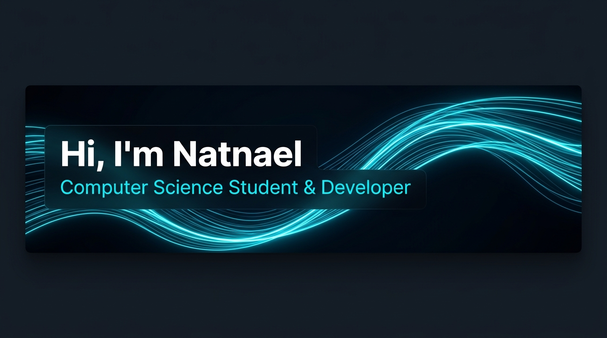

  

   

  <h1>Hi, I'm Natnael Asnake 👋</h1>
  
<b>Computer Science Student & Software Developer</b>

  
<i>Building scalable applications, intuitive interfaces & exploring intelligent systems</i>

  

    
    
    
    
  

---

### 💫 About Me

- 🔭 I'm a fourth-year Computer Science student at **American College of Technology**.
- 💡 Passionate about turning complex real-world problems into clean, efficient, and user-centric software.
- 🚀 Actively working across full-stack development, machine learning, and cloud infrastructure.
- 💬 Ask me about **C++, Python, Web Development, or AI**.

---

### 💻 Tech Stack

#### 🌐 Frontend Development

  

  
  
  

#### ⚙️ Backend Development

  

  
  
  
  

#### ☁️ Database & Cloud / DevOps

  

  
  
  
  

#### 🤖 Machine Learning & AI

  

  
  

#### 🎨 Design & Creative Tools

  

  
  
  
  

---

### 🏆 GitHub Trophies

  

---

### 📊 Most Used Languages

  

---

### 🌟 Beyond Code

<table align="center" width="100%">
  <tr>
    <td align="center" width="25%" valign="top">
        
      <b>Football</b> 
      Playing the game ⚽
    </td>
    <td align="center" width="25%" valign="top">
        
      <b>Board Games</b> 
      Strategy & tabletop 🎲
    </td>
    <td align="center" width="25%" valign="top">
        
      <b>Languages</b> 
      Exploring linguistics 🌍
    </td>
    <td align="center" width="25%" valign="top">
        
      <b>Origami</b> 
      The art of paper folding ⛵
    </td>
  </tr>
</table>

---

### 🤝 Let's Connect

Feel free to reach out for collaborations, project discussions, or tech chats!

